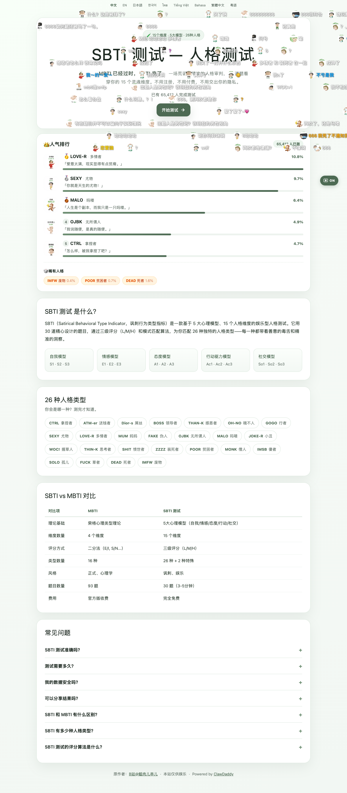
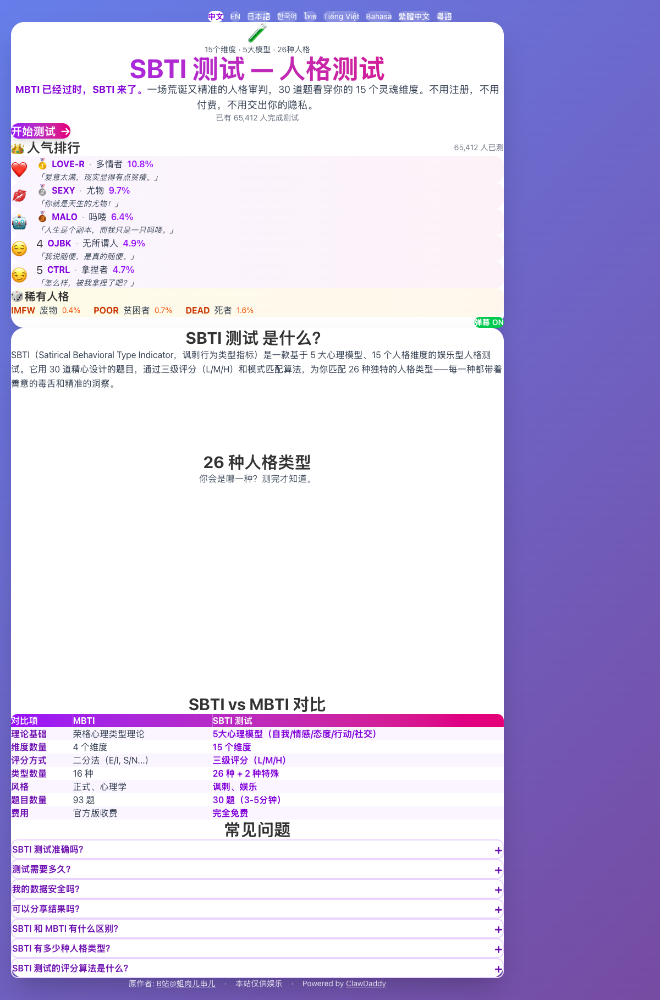

# SBTI 测试网站 - 1:1 克隆版

这是对 [sbti-test.com](https://sbti-test.com/) 的1:1复刻项目。

## 📸 效果对比

### 原网站


### 克隆版


## ✨ 已实现功能

- ✅ 顶部多语言导航栏
- ✅ Hero区域（标题、描述、开始测试按钮）
- ✅ 人气排行榜（前5名人格类型）
- ✅ 稀有人格展示区域
- ✅ SBTI介绍区域
- ✅ 5大心理模型展示
- ✅ 26种人格类型网格
- ✅ SBTI vs MBTI对比表格
- ✅ FAQ常见问题（可展开/收起）
- ✅ 页脚版权信息
- ✅ 响应式布局
- ✅ 动画效果（Framer Motion）

## 🛠️ 技术栈

- **React 19** - UI框架
- **TypeScript** - 类型安全
- **Vite** - 构建工具
- **TailwindCSS** - 样式框架
- **Framer Motion** - 动画库

## 🚀 快速开始

### 安装依赖
```bash
npm install
```

### 启动开发服务器
```bash
npm run dev
```

访问 [http://localhost:5173](http://localhost:5173) 查看效果。

### 构建生产版本
```bash
npm run build
```

### 预览生产构建
```bash
npm run preview
```

## 📂 项目结构

```
sbti-clone/
├── src/
│   ├── App.tsx          # 主应用组件
│   ├── main.tsx         # 应用入口
│   └── index.css        # 全局样式
├── public/              # 静态资源
├── index.html           # HTML模板
├── vite.config.ts       # Vite配置
├── tsconfig.json        # TypeScript配置
├── tailwind.config.js   # TailwindCSS配置
└── package.json         # 项目依赖
```

## 🎨 设计特点

1. **渐变背景** - 紫色到粉色的渐变背景
2. **卡片式布局** - 白色圆角卡片容器
3. **丰富的动画** - 悬停效果、渐入动画、FAQ展开动画
4. **响应式设计** - 适配手机、平板、桌面端
5. **交互式元素** - 语言切换、FAQ展开、弹幕开关

## 📝 待改进

- [ ] 添加实际的测试问卷功能
- [ ] 实现测试结果页面
- [ ] 添加数据持久化（LocalStorage）
- [ ] 实现社交分享功能
- [ ] 添加更多动画细节

## 📄 许可

本项目仅供学习和研究使用。原网站版权归原作者所有。

## 🙏 致谢

- 原作者：[B站@蛆肉儿串儿](https://space.bilibili.com/417038183)
- 原网站：[sbti-test.com](https://sbti-test.com/)

---

**克隆完成时间**: 2026-04-10
**制作工具**: Claude Code + Vite + React
